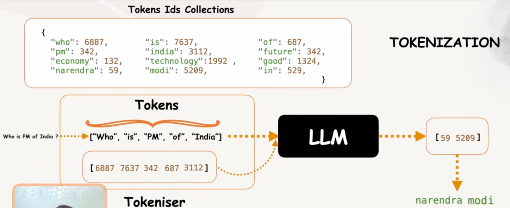

# Introduction to Generative AI

Generative AI refers to a class of artificial intelligence models designed to create new content, such as text, images, audio, or code, by learning patterns from existing data. Unlike traditional AI that focuses on classification or prediction, generative AI aims to produce original outputs that mimic human creativity. Examples include language models like GPT (Generative Pre-trained Transformer) that generate coherent text, or diffusion models used for image synthesis.

Key characteristics:
- **Training Data**: Relies on large datasets to learn distributions and patterns.
- **Applications**: Used in content creation, chat-bots, art generation, and more.
- **Technologies**: Often based on deep learning architectures like transformers or GANs (Generative Adversarial Networks).

Generative AI has revolutionized fields like natural language processing and computer vision, enabling tools that assist in writing, designing, and innovating.

## Traditional AI. vs Generative AI
Traditional AI — classifies or predicts from fixed categories (spam/not spam, fraud/not fraud).
Generative AI — creates new content (text, images, code) by learning patterns from data.
Core difference: Traditional AI picks an answer; Generative AI produces one.

## LLM
A **Large Language Model** is a neural network trained on massive text data to predict the next token — which emergently gives it the ability to understand and generate human language.

**Scale**: billions of parameters, trained on internet-scale text
**Mechanism**: Transformer architecture + self-attention
**Capability**: writing, summarizing, coding, reasoning, Q&A
**Examples**: Claude, GPT-5, Gemini, LLaMA
LLMs are the core engine behind most Generative AI products today.

---

LLMs are trained on one task: predict the next word.

- To do it well across all human text, the model is forced to learn grammar, facts, reasoning, and meaning — not because anyone programmed it, but emergently, as a side effect of scale.

- Like a student who reads everything ever written — they become knowledgeable simply because understanding is required to predict well.

---

LIM : Large Image Model ==> Models which generates images based on user prompt (Example: Google Nano Banana)
LVM : Large Vision Model ==> Models which generates images and videos based on user prompt (Example: Google Veo Model)
LAM : Large Audio Model ==> Models which generates audio based on user prompt (Example: Google Nano Banana)

---

GPT stands for **Generative Pre-trained Transformer**.
1. **Generative**: The capability to create new content based on user input.
2. **Pre-trained**: Models are trained on extensive data from the internet, books, and code
3. **Transformer & Attention Mechanism**: A special neural network architecture that understands context. The Attention Mechanism allows the model to determine relationships between words (e.g., distinguishing between a 'financial bank' and a 'river bank' based on context) 
   
## Next Word Prediction 
LLMs function by predicting the most probable next word in a sequence based on the input context . Here is how the mechanism works:

- Iterative Generation: The model does not generate a full sentence at once. Instead, it takes the user's input and predicts the single most probable next word.
- Continuous Feedback Loop: Once the model predicts a word, that word is added to the original input to create a new, updated sequence. The model then uses this updated sequence to predict the following word.
- Probability Distribution: The model rarely picks just one candidate; it calculates a set of potential words with varying probabilities. It selects the one with the highest probability to continue the sequence.
- Completion: This cycle repeats—adding the new word to the input and predicting the next one—until the model determines that the text is complete or it reaches a defined limit.
---


- In the image shown, The whole process is known as **Tokenization**, each split words are called as **Tokens** and the entity which split words and amp them with numbers from LLM storage dictionary, is called as **Tokenizer**
- Each LLM Models contain the Billions/Trillions of Token Ids collections(This mapping varies by LLM models) which is used by Tokenizer to map words with numbers so that LLMs can understand them because LLMs only understand numbers and output in numbers.
- Check this out to play with tokens and tokenizer(https://platform.openai.com/tokenizer)
- We can also create our own tokenizer and token Id mapping
```python
    import tiktoken
    text: str = "Who is the PM of India?"
    tokenizer = tiktoken.encoding_for_model(model_name="gpt-5")
    tokenIds: list[int] = tokenizer.encode(text)
    print(tokenIds) # [20600, 382, 290, 7188, 328, 8405, 30]
    resultIds: list[int] = [117149, 32364, 69830, 382, 290, 9197, 19161, 328, 8405, 13]
    finalAnswer : str = tokenizer.decode(resultIds)
    print(finalAnswer) # Narendra Modi is the prime minister of India.
```

## Context Window & Cost 
Think of an LLM like **ChatGPT** reading a document. It doesn’t remember your entire conversation forever—it only considers a fixed number of tokens (chunks of text) at once.
A token ≈ word or part of a word
The context window = maximum number of tokens the model can handle in a single request (input + output)

If a model has a 128K token context window:
- It can read your prompt + conversation history up to 128,000 tokens
- If you exceed that: Older parts get truncated (forgotten)

---

All the LLM Models charge us based on number of tokens(Input, output and Cache all tokens are charged)