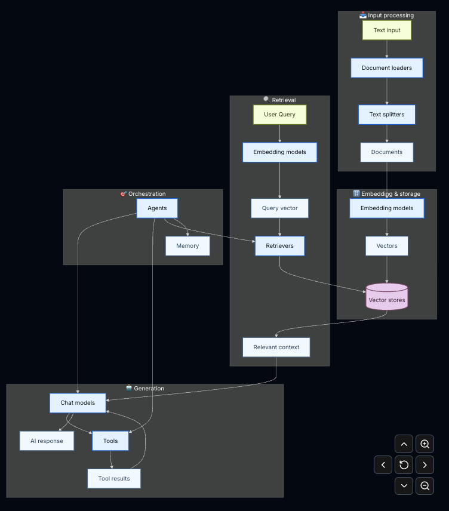

# LangChain

LangChain is a framework for building applications powered by large language models (LLMs) like OpenAI’s GPT models,
Anthropic’s Claude, Google Gemini or open-source models.
You can build completely custom agents and applications powered by LLMs in under 10 lines of code, with integrations for
OpenAI, Anthropic, Google, and more.
LangChain provides a prebuilt agent architecture and model integrations to help you get started quickly and seamlessly
incorporate LLMs into your agents and applications.
Instead of just calling an LLM once, LangChain helps you orchestrate complex workflows where the model can:

- Remember context
- Call external tools (APIs, databases)
- Chain multiple steps together
- Act more like an intelligent agent

## Core Idea (Why LangChain exists)

Raw LLM usage looks like:

```text
Input → LLM → Output
```

LangChain turns it into something more powerful:

```text
Input → Prompt → LLM → Tool/API → Memory → Next Step → Final Output
```

It helps you build real-world AI systems, not just chat responses.

---

# LangChain Components


LangChain organizes its building blocks into seven core categories, each with a distinct responsibility in the AI
application stack. Understanding these layers is essential for designing modular, maintainable LLM-powered systems.

### 1. Models

**Purpose:** AI reasoning and generation
The foundation of any LangChain application. Models abstract over different AI providers (OpenAI, Anthropic, Cohere,
etc.) and modalities.
**Use Cases:** Text generation, chain-of-thought reasoning, semantic similarity, classification

---

### 2. Tools

**Purpose:** External capability extension

Tools allow agents and chains to interact with the outside world — anything beyond the model's parametric knowledge.
**Use Cases:** Web search, API calls, database etc.

---

### 3. Agents

**Purpose:** Orchestration and autonomous reasoning

Agents use models to decide *which* tools to call and *when*, enabling non-deterministic, multi-step workflows.

| Component           | Description                                      |
|---------------------|--------------------------------------------------|
| ReAct Agents        | Reason + Act loops with scratchpad traces        |
| Tool Calling Agents | Structured function-calling via model APIs       |
| Custom Agents       | `BaseSingleActionAgent` / `BaseMultiActionAgent` |

**Use Cases:** Autonomous task completion, dynamic routing, multi-tool workflows, decision trees

---

### 4. Memory

**Purpose:** Context preservation across turns

Memory components inject prior conversation state or derived context into the model's prompt window.

| Component                    | Description                                 |
|------------------------------|---------------------------------------------|
| `ConversationBufferMemory`   | Stores full message history verbatim        |
| `ConversationSummaryMemory`  | Condenses history via a summarization model |
| `VectorStoreRetrieverMemory` | Retrieves semantically relevant past turns  |
| Custom State                 | Arbitrary key-value state via `BaseMemory`  |

**Use Cases:** Multi-turn chat, session continuity, long-horizon task tracking

---

### 5. Retrievers

**Purpose:** Information access at query time

Retrievers separate knowledge storage from generation — the core primitive in RAG architectures.
Given a query, they fetch only the most relevant chunks from a vector store, ensuring the generator works with focused,
high-signal context rather than everything.

| Component              | Description                                            |
|------------------------|--------------------------------------------------------|
| Vector Retrievers      | Nearest-neighbor search over embedded documents        |
| Web Retrievers         | Live retrieval from search engines                     |
| Self-Query Retrievers  | LLM-generated metadata filters on top of vector search |
| Multi-Query Retrievers | Reformulates queries to improve recall                 |

**Use Cases:** RAG pipelines, knowledge base Q&A, document search, hybrid search

---

### 6. Document Processing

**Purpose:** Data ingestion and transformation

Handles the ETL pipeline for unstructured data before it enters a vector store or prompt. Essentially, we generate
vector embeddings of the
processed data.

| Component        | Description                                           |
|------------------|-------------------------------------------------------|
| Document Loaders | Ingest from PDFs, URLs, S3, Notion, databases, etc.   |
| Text Splitters   | Chunk documents (recursive, token-aware, semantic)    |
| Transformers     | Post-process documents (translate, summarize, filter) |

**Use Cases:** PDF ingestion, web scraping, document pre-processing, corpus preparation

---

### 7. Vector Stores

**Purpose:** Semantic search and embedding persistence

Persistent storage for embedded document chunks, enabling similarity search at runtime. This is storage for Vector
embeddings of processed data.

| Component         | Description                                              |
|-------------------|----------------------------------------------------------|
| Chroma            | Lightweight, local-first, easy to prototype              |
| FAISS             | Facebook's high-performance in-memory index (CPU/GPU)    |
| Pinecone          | Managed cloud vector DB, production-grade scaling        |
| pgvector          | PostgreSQL extension — good for existing Postgres stacks |
| Weaviate / Qdrant | Open-source, self-hostable, feature-rich alternatives    |

**Use Cases:** Similarity search, document retrieval, embedding deduplication, semantic caching

---

# Prompts

Generally, the input to LLM is passed as prompts instead of strings.
There are 2 types of Prompt ==> 1. Static Prompts, 2. Dynamic Prompts
---

## 1. Static Prompts

```python
from langchain_core.prompts import ChatPromptTemplate

prompt = ChatPromptTemplate.from_messages([
    ("system", "You are a Python developer."),
    ("user", "Write a function to read a CSV file.")  # hardcoded
])
prompt.invoke()
```

Same question every time. No flexibility.

## 2. Dynamic Prompts

It has placeholders {} that change based on input.

```python
from langchain_core.prompts import ChatPromptTemplate

prompt = ChatPromptTemplate.from_messages([
    ("system", "You are a {language} developer."),  # dynamic
    ("user", "Write a function to {task}.")  # dynamic
])

# Invoke with different values:
prompt.invoke({"language": "Python", "task": "read a CSV"})
prompt.invoke({"language": "Java", "task": "connect to database"})
```

---

In LangChain, prompts can be passed as tuples — **(role, message)**.
**Roles**:
"system" → sets AI behavior/context
"ai" → previous AI response (for conversation history)
"user" → what the human asks

Example:

```python
from langchain_core.prompts import ChatPromptTemplate

prompt = ChatPromptTemplate.from_messages([
    ("system", "You are a helpful coding assistant."),
    ("ai", "Sure! I can help you with Python, Java, and more."),
    ("user", "Explain {topic} with an example.")
])
```

What each does:

**("system", ...)** → tells the LLM how to behave (Once you tell LLM how to behave, for further questions, it will act
like
that while answering)
**("ai", ...)** → simulates a prior AI response (sets tone/context) → The LLM sees that "ai" message as its own previous
reply — so it continues in that same tone and style.
**("user", ...)** → the actual question, with {topic} as a variable placeholder → Questions asked by Humans(Users)

So when you invoke it:

```python
from langchain_core.prompts import ChatPromptTemplate

# Static Prompts
prompt = ChatPromptTemplate.from_messages([
    ("system", "You are a helpful coding assistant/ You are a Senior Python Developer"),
    ("ai", "Sure! I can help you with Python, Java, and more."),
    ("user", "Explain {topic} with an example.")
])
prompt.invoke({"topic": "RAG"})
```

It fills in {topic} → "RAG" and sends all three messages in order to the LLM.

## Real life example of roles:

A Python developer sits at his desk. Before anyone comes to him, he already has some ground rules in his mind (given by
his manager/team):

"You only write Python, not Java or C++"
"Always write unit tests with the code"
"Never give incomplete code"

These are his system rules — set before any conversation begins.

Now a colleague walks up and says:
Colleague (user): "Hey, can you write a function to connect to a database?"
Developer (ai): "Sure! Here's the Python code with unit tests..."

```python
from langchain_core.messages import AIMessage
from langchain_google_genai import ChatGoogleGenerativeAI

llm = ChatGoogleGenerativeAI(model="gemini-2.5-flash-lite")
prompts = [
    ("system",
     "You are a Python developer. You only write Python code, always include unit tests, and never give incomplete code."),
    ("user", "Write a function to {task}."),
    ("ai", "Sure! Here's the complete Python code with unit tests for {task}...")
]
response: AIMessage = llm.invoke(prompts)
print(response.content)
```

The developer didn't decide these rules himself — someone set them before the conversation started. That's exactly what
system does to the LLM — sets the rules before the user even says hello.