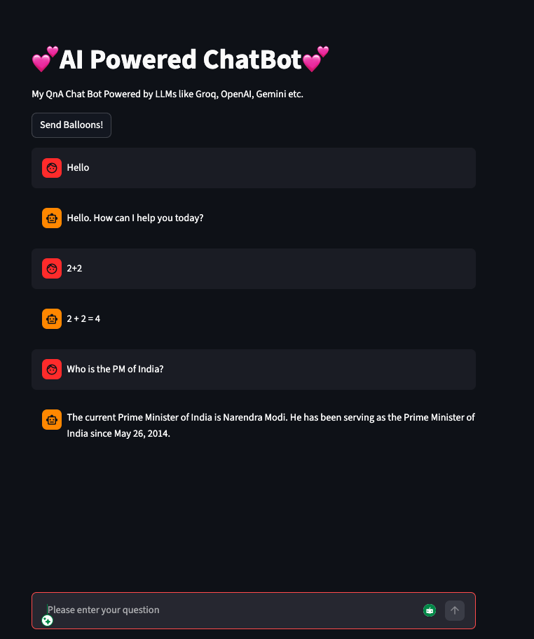

# Streamlit

It is a faster way to build and share data apps. You can turn your data scripts into shareable web apps in minutes, all
in pure Python. No front‑end experience required.

```python
import streamlit as st
from dotenv import load_dotenv
from langchain_core.language_models import BaseChatModel
from langchain_core.output_parsers import StrOutputParser
from langchain_groq import ChatGroq


def chatBotQA(llmProvider: BaseChatModel):
    """
    Runs a simple terminal-based QA chatbot loop.
    :param llmProvider: The LLM backend to invoke.
    :type llmProvider: BaseChatModel
    """
    outputParser = StrOutputParser()
    while True:
        question: str = input("User: ")
        if question in ["exit", "quit", "bye"]:
            print("Goodbye! 👋")
            break
        chain = llmProvider | outputParser
        answer: str = chain.invoke(question)
        print(f"AI: {answer}")


def chatBotQAWithStreamlit(llmProvider: BaseChatModel):
    """
    Runs a Streamlit-based QA chatbot with persistent chat history.
    :param llmProvider: The LLM backend to invoke.
    :type llmProvider: BaseChatModel
    """
    for message in st.session_state.messages:
        role: str = message["role"]
        content: str = message["content"]
        st.chat_message(role).markdown(content)
    query = st.chat_input("Please enter your question")
    outputParser = StrOutputParser()
    if query:
        st.session_state.messages.append(
            {"role": "user", "content": query}
        )  # Here we are adding current question in history so that it is visible on top of next questions to give chatbot feeling
        st.chat_message("user").markdown(query)
        chain = llmProvider | outputParser
        aiResponse: str = chain.invoke(query)
        st.chat_message("ai").markdown(aiResponse)
        st.session_state.messages.append(
            {"role": "ai", "content": aiResponse}
        )  # Here we are adding current answer in history so that it is visible on top of next questions to give chatbot feeling


if __name__ == "__main__":
    load_dotenv()
    groqLLM: ChatGroq = ChatGroq(model="llama-3.3-70b-versatile")
    # Initialize only once — not on every rerun
    if "messages" not in st.session_state:
        st.session_state.messages = []
    st.title("💕AI Powered ChatBot💕")
    st.markdown("My QnA Chat Bot Powered by LLMs like Groq, OpenAI, Gemini etc.")
    if st.button("Send balloons!"):
        st.balloons()
    chatBotQAWithStreamlit(groqLLM)


```


---
If you see above code, we are not managing the memory of out ChatBot. Essentially, if ask it who is the PM of India, it
will respond first time like Narendra Modi but
if I again ask, what is his age, the chatbot won't be able to figure out whom are we talking about as it won't
understand **he**.
To solve this problem, we have to add memory to our Chatbot
---

### Learn about streamlit [here](https://docs.streamlit.io/get-started/installation/command-line)