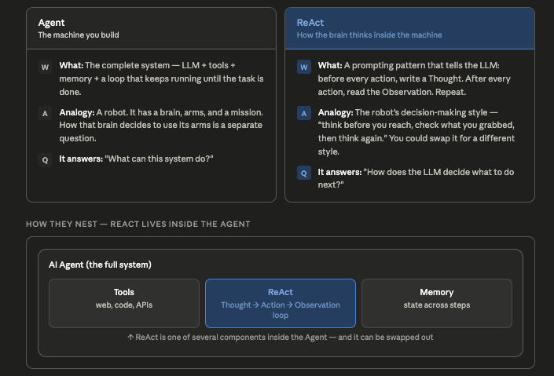

# Problem

- LLMs are powerful—but on their own, they’re basically stateless text generators. The only task which LLM can do on
  its own is given a text input, it will generate some text output.
- It can not take actions on its own like calling some APIs, querying databases, doing google search for something which
  is not available in LLM knowledge base.

### ❌ No persistence

It doesn’t remember past steps unless you pass everything again(Like we have doing in our practice codes, where we are
passing all history + current prompt to it for each query.)

### ❌ No decision loops

It won’t say:
"Hmm, this failed, let me retry differently."

### ❌ No tool usage (natively)

It can suggest calling an API, but it can’t actually do it.

### ❌ No planning

It doesn’t break big problems into structured steps unless guided.

### ❌ No execution

It can write code—but it won’t run it.

---

In real world AI Applications, we need all of these capabilities where our system should be smart enough to make
decisions, execute codes, make API calls, can interact with tools(e.g. MCP tools), correct the mistakes it made etc.

# AI Agents

AI Agents come into picture to help with above problem. They can do all of above tasks.

### 1. Planning

Agents can break problems into steps:

“Search → analyze → summarize → verify”

### 2. Memory

They maintain:

Short-term memory (conversation)
Long-term memory (vector DB, logs, state)

### 3. Tool usage

Agents can actually do things:

Call APIs
Query databases
Run code
Trigger workflows

Frameworks like LangChain and AutoGPT help orchestrate this.

### 4. Iteration & feedback loops

Agents can:

Retry on failure
Evaluate outputs
Improve results

### 5. Autonomy (to a degree)

Instead of saying "Write an email", You can say, "Find top 5 candidates, analyze resumes, draft outreach, send emails"
And the agent coordinates everything.

```text
LLM = Brain
Agent = An AI Agent = LLM (brain) + Tools (hands) + Memory (notepad) + Loop (autonomy)
```



---

# ReAct(Reasoning + Acting)

ReAct is one of the most important patterns in agentic AI. it is what turns an LLM from “just answering” into something
that can reason + act in a loop. ReAct is the control loop that makes LLMs behave like agents instead of chatbots.

**Thought → Action → Observation → Thought → Action → Observation → Thought → Action →... → Final Answer**

```text
Who is the CEO of Tesla and what is his age?

Thought: I need CEO of Tesla
Action: search("Tesla CEO")
Observation: Elon Musk is CEO of Tesla

Thought: Now I need his age
Action: search("Elon Musk age")
Observation: 54

Final Answer: Elon Musk, 54 years old
```

## Why ReAct is powerful

### 1. Breaks complex problems

Instead of guessing everything in one go, it

- decomposes tasks
- reduces hallucination

### 2. Enables tool usage

- It works with APIs, databases, search engines, code execution.
- It is used heavily in frameworks like LangChain.

### 3. Iterative correction

If something fails:

- **Observation**: API failed
- **Thought**: Try alternative API

### 4.Transparent reasoning

You can see how the model is thinking (useful for debugging). You see these in most LLM, where they keep on printing
something like:

thinking: some content
thought for 1 seconds
observation: I need to do this that blah blah blah

```text
while not done:
    think = LLM(context)
    action = parse(think)
    observation = execute(action)
    context += think + observation
```

## Where ReAct is used

- Coding agents (debug → run → fix)
- Research agents (search → read → summarize)
- Support bots (query → fetch → respond)
- DevOps agents (detect → analyze → act)

## Agents vs ReAct

- **Agent** is the system. **ReAct** is the strategy the LLM uses to think inside that system.
- You can build an agent without **ReAct** — it will just call tools more blindly, make more mistakes, and produce no
  auditable reasoning trace. ReAct is what gives agents the ability to self-correct mid-task.



```python
from dotenv import load_dotenv
from langchain.agents import create_agent
from langchain_core.language_models import BaseChatModel
from langchain_core.tools import tool
from langchain_groq import ChatGroq
from pydantic import BaseModel, Field

load_dotenv()


class AddNumber(BaseModel):
	"""The model for adding numbers"""

	a: int = Field(description="First number")
	b: int = Field(description="Second number")


@tool("add_number", args_schema=AddNumber)
def add_number(a: int, b: int) -> int:
	"""Adds two numbers and returns the sum"""
	return a + b


@tool("square_number")
def square_number(number: int) -> int:
	"""Calculate and return square of number"""
	return number * number


llmProvider: BaseChatModel = ChatGroq(model="llama-3.3-70b-versatile")
number_adder_tool = create_agent(model=llmProvider, tools=[add_number, square_number])

response = number_adder_tool.invoke(
	{"messages": [{"role": "user", "content": "What is 2+3"}]}
)
for response in response["messages"]:
	print(response)
	print()

# The output of above for loop would be:

"""
---- ReAct Pattern internally used by our Agent-----
# Think
content='What is 2+3' additional_kwargs={} response_metadata={} id='5ed0b2a4-b096-40e7-a0fa-a7f659d1c17e'

# Action
content='' additional_kwargs={'tool_calls': [{'id': '5gf79sf6x', 'function': {'arguments': '{"a":2,"b":3}', 'name': 'add_number'}, 'type': 'function'}]} response_metadata={'token_usage': {'completion_tokens': 19, 'prompt_tokens': 289, 'total_tokens': 308, 'completion_time': 0.053982318, 'completion_tokens_details': None, 'prompt_time': 0.02860303, 'prompt_tokens_details': None, 'queue_time': 0.054717614, 'total_time': 0.082585348}, 'model_name': 'llama-3.3-70b-versatile', 'system_fingerprint': 'fp_dae98b5ecb', 'service_tier': 'on_demand', 'finish_reason': 'tool_calls', 'logprobs': None, 'model_provider': 'groq'} id='lc_run--019de7a4-7074-7da3-a144-a1bf75f84141-0' tool_calls=[{'name': 'add_number', 'args': {'a': 2, 'b': 3}, 'id': '5gf79sf6x', 'type': 'tool_call'}] invalid_tool_calls=[] usage_metadata={'input_tokens': 289, 'output_tokens': 19, 'total_tokens': 308}

# Observation
content='5' name='add_number' id='8cf631dc-230d-4674-a56c-a6e6615b8d47' tool_call_id='5gf79sf6x'

# Result
content='The answer is 5.' additional_kwargs={} response_metadata={'token_usage': {'completion_tokens': 7, 'prompt_tokens': 319, 'total_tokens': 326, 'completion_time': 0.04211905, 'completion_tokens_details': None, 'prompt_time': 0.015611856, 'prompt_tokens_details': None, 'queue_time': 0.162087812, 'total_time': 0.057730906}, 'model_name': 'llama-3.3-70b-versatile', 'system_fingerprint': 'fp_3272ea2d91', 'service_tier': 'on_demand', 'finish_reason': 'stop', 'logprobs': None, 'model_provider': 'groq'} id='lc_run--019de7a4-71b3-7742-9a1d-b6b225c010b9-0' tool_calls=[] invalid_tool_calls=[] usage_metadata={'input_tokens': 319, 'output_tokens': 7, 'total_tokens': 326}
"""

```
