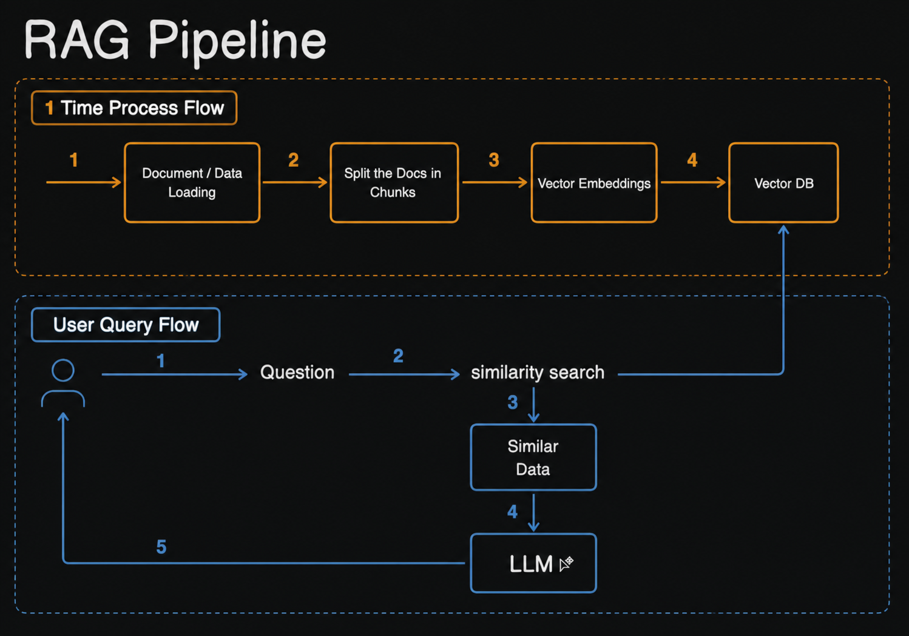
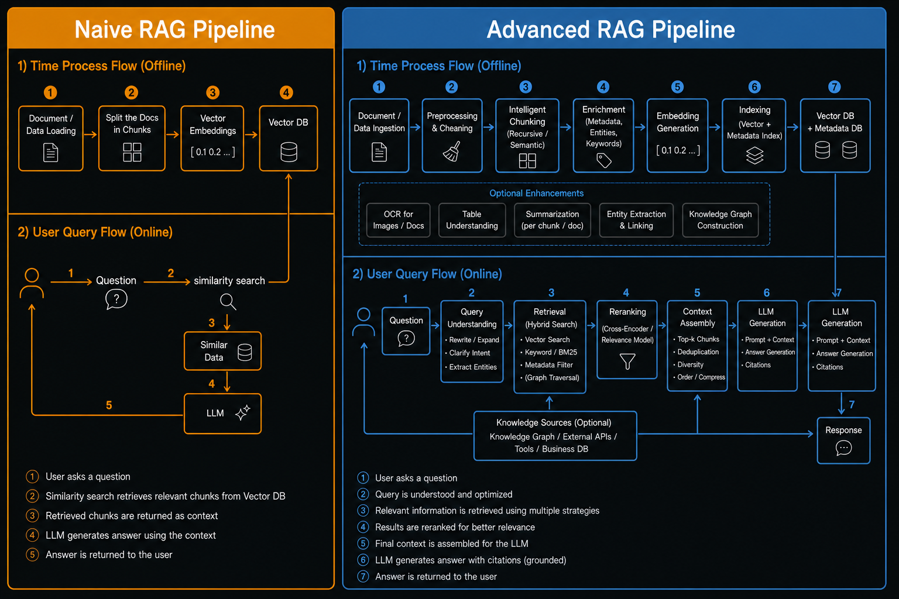
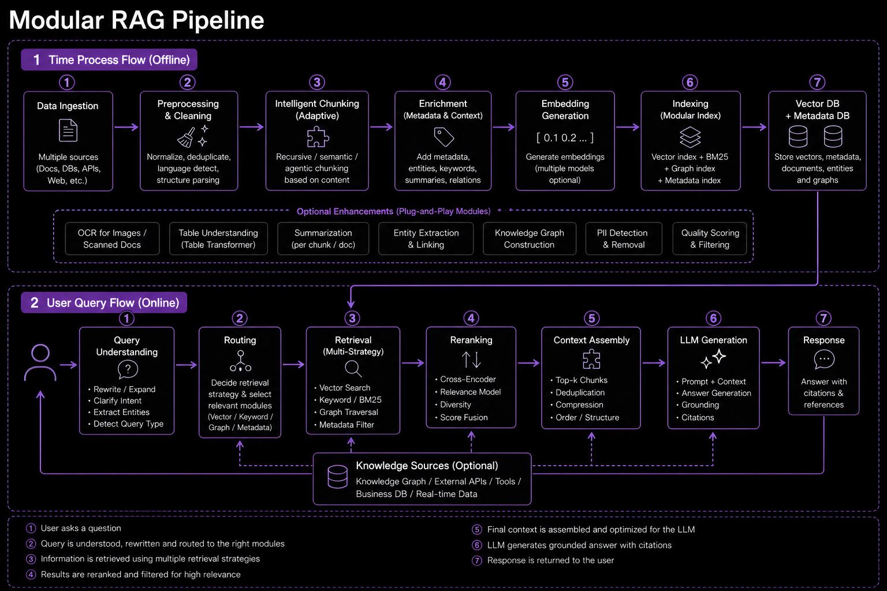

# Context/Prompt stuffing

Prompt stuffing is exactly what it sounds like — you stuff all the information directly into the prompt and send it to
the AI.

- We do **Prompt Stuffing** daily when we **attach(Manual or via some script)** some PDFs, Docs, Gitlab MRs, Confluence
  pages while asking some questions to our LLMs (e.g. via Cursor IDE, Calude Code, ChatGPT etc.)

```bash
You: "Review this MR: gitlab.com/repo/merge_requests/123"

Behind the scenes:
1. Tool fetches the MR page
2. Dumps the entire MR content into the prompt
3. LLM reads it all and answers
```

The AI reads everything you pasted and answers. That's it. No search, no indexing, no retrieval. Just raw text dumped
into the prompt. For a quick one-off question on a small document — it works fine. But If your critical information is
buried in the middle of a huge prompt(say 50 pages of text) — the AI is likely to miss or underweight it. This is a
well-documented property of transformer attention, not a bug you can fix with prompting.

- That is the problem with **Prompt Stuffing** because it sends everything to LLMs and hopes that LLM will find the
  answer.
- Since all the content is being sent to LLMs, the **token** cost would be way higher.

To solve all the problems which we discussed above, we have another technique called *RAG**.

# RAG(Retrieval-Augmented Generation)

RAG is a technique(architectural pattern) where, before the AI answers your question, it first searches a knowledge
base and reads the most relevant results and sends only the relevant content to LLMs which LLMs use to give you a
grounded, accurate answer. It lets any AI answer questions about any document, any data, updated any time — without ever
retraining the model.
> Think of it like an open-book exam.
>
> The LLM is the student. RAG is the permission to check the notes.

| Word           | Plain meaning                                    |
|----------------|--------------------------------------------------|
| **Retrieval**  | Find the right information from a knowledge base |
| **Augmented**  | Add that information to the question/prompt      |
| **Generation** | Let the LLM answer using it                      |

---

# Types of RAG

1. **Naive RAG (Fixed Pipeline)**
2. **Advanced RAG (Fixed Pipeline)**
3. **Modular RAG (Variable Pipeline)**

## 1. Naive RAG

The simplest possible version. Straight pipeline, no optimization. Just focus on the top flow(1 time process).

---
**How it works?**

1. Split the documents into chunks
2. Convert these chunks to vector embeddings and store these vectors into vector DB
3. User asks a question → perform similarity search on Vector DB → Send Result to LLM

### Pros

Simple to build. Works for basic use cases. Great starting point.

### Cons

| Problem                          | What happens                                                                                                                                                         |
|----------------------------------|----------------------------------------------------------------------------------------------------------------------------------------------------------------------|
| **Bad chunking**                 | Imagine cutting a book into pieces mid-sentence. The chunk says "the price is" — and the next chunk says "30 dollars." Neither makes sense alone.                    |
| **Keyword mismatch**             | You search "car repair" but the document uses the word "automobile." They mean the same thing but the system doesn't find it.                                        |
| **Top-k is dumb**                | The system returns the 5 most similar chunks — but similar does not always mean useful. You get close-but-wrong answers.                                             |
| **No context**                   | The LLM gets a small piece of text with no idea what came before or after it. Like reading one random page from a book and being asked to summarise the whole story. |
| **Hallucination still possible** | If the right chunk is never found, the LLM has nothing to read. So it makes up an answer instead of saying "I don't know."                                           |

### 2. Advanced RAG

Fixes the weak spots of Naive RAG — better retrieval before and after the search.
> Advanced RAG is like a smart Google search.
> You type "cheap flights" — Google understands you also mean "affordable airfare", searches across multiple sources,
> and
> shows you only the most relevant results at the top — not every page that mentioned the word "flight."

1. What's new — before retrieval:
    - **Query rewriting** — if the user types a vague question, the system rephrases it into a better search query
      before searching
    - **Hybrid search** — combines keyword search + semantic search so "car" and "automobile" both match
    - **Better chunking** — smarter splitting that preserves meaning

2. What's new — after retrieval:
    - **Reranking** — retrieved chunks are re-scored by a second, more precise model. Best chunks rise to the top
    - **Context compression** — irrelevant sentences inside a chunk are trimmed before sending to LLM



### 3. Modular RAG

Naive and Advanced RAG has fixed pipeline(flow). Every question goes through the exact same steps — chunk, embed,
search, rerank, answer. But in real life different questions need different approaches to answer.

| Question                           | What it really needs     |
|------------------------------------|--------------------------|
| "What is our refund policy?"       | Search internal docs     |
| "What happened in the news today?" | Search the web           |
| "How many orders last month?"      | Query a database         |
| "How are product A and B related?" | Search a knowledge graph |

A fixed pipeline can't handle all of these well. Modular RAG can — because it picks the right tool for each question.

1. When do you actually need Modular RAG?
   You probably don't need it right away. You need it when:
    - Your app needs to answer questions from multiple different sources — not just one document collection
    - Different types of questions need completely different retrieval strategies
    - You want to add new data sources without breaking the existing system



The Router is the brain. It reads the question and decides which module(s) to activate. Results from all activated
modules are then combined and sent to the LLM.

**How the Router thinks?**
When a question comes in, the Router asks itself three things:

1. **What type of question is this?** — factual, analytical, relational, real-time?
2. **Where does the answer likely live?** — internal docs, database, web, knowledge graph?
3. **How should I search?** — keyword match, semantic search, SQL query, graph traversal?

Based on the answers, it picks the right modules and fires them.

```text
Say your app serves a customer support agent. Three questions come in:

Question 1: "What is our cancellation policy?"
Router thinks → this is in our internal docs → activates vector search only

Question 2: "How many refunds were processed this week?"
Router thinks → this is a numbers question → activates SQL database only

Question 3: "What are competitors charging for the same plan?"
Router thinks → this is external, real-time → activates web search only
Same system. Same router. Three completely different paths. The user never sees any of this — they just get the right answer.
```

---

### Which one should you start with?

> Start with Naive RAG to understand the fundamentals. Move to Advanced RAG when accuracy matters in production.
> Consider Modular RAG only when you have multiple data sources or complex routing needs. Modular RAG is the
> destination.