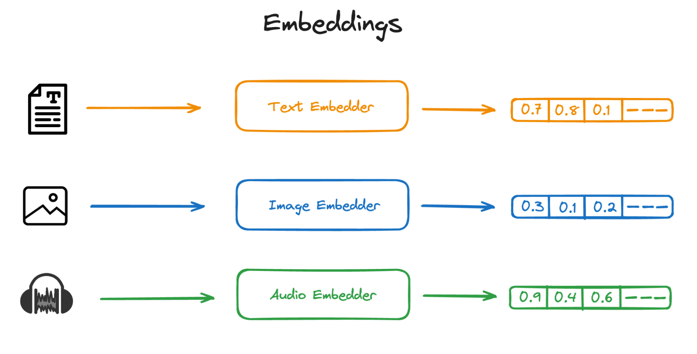
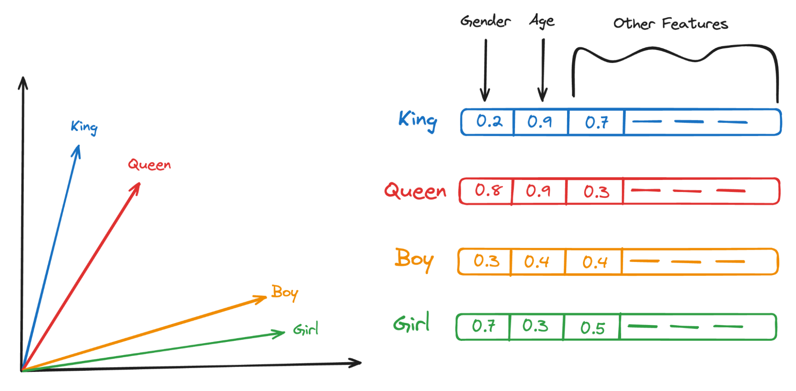
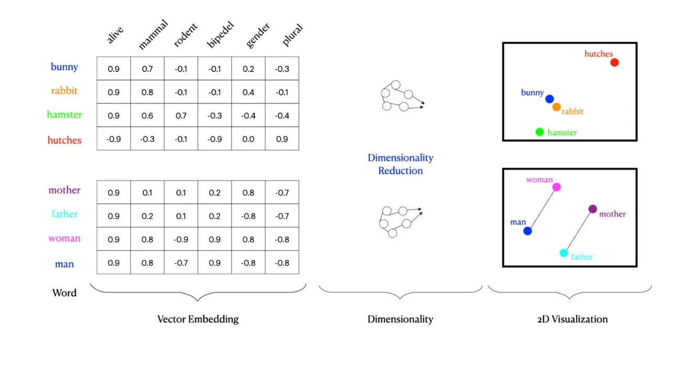
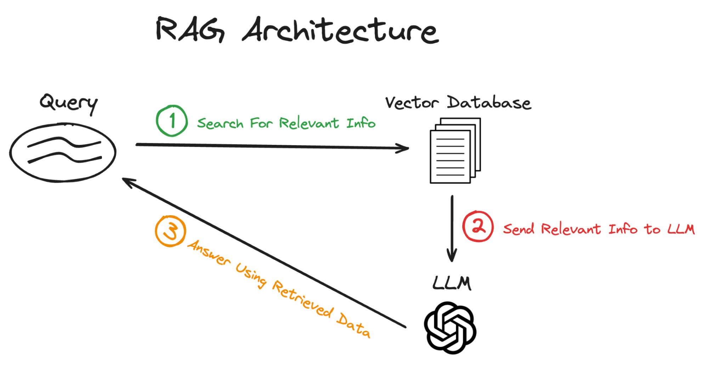
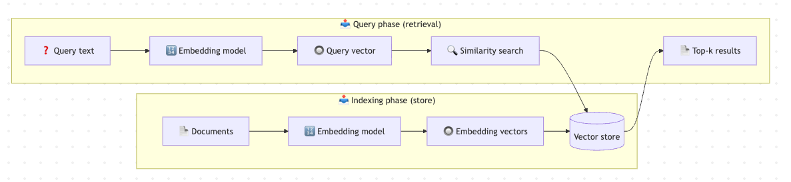

# Vector Embeddings

- A vector embedding converts data — such as text, images, or audio — into a numerical representation (a
  high-dimensional vector, e.g., a 1256-dimensional array) that captures its semantic meaning. These vectors allow
  machines to compare and search text based on meaning rather than exact words.

- In practice, this means that texts with similar ideas are placed close together in the vector space. For example,
  instead of matching only the phrase “machine learning”, embeddings can surface documents that discuss related concepts
  even when different wording is used.

---

# Types of Embeddings

1. **Text embeddings**
   Text embedding convert text into a set of vectors where each vector represents a word or a sentence. Techniques like
   **Word2Vec**, **GloVe**, and **BERT** are commonly used for this purpose.
   These models work by learning representations for words based on their contexts in large text corpora. For instance,
   words that appear in similar contexts, like "king" and "queen," will have close vector representations.

2. **Image embeddings**
   Another data type is images. Similar to text embeddings, image embedding involves converting images into a vector of
   numbers. Such embeddings require a different type of embedders, in this case, **Convolutional Neural Networks** are
   typically used to generate these embeddings.
   An image is passed through various layers of the CNN, which extract features at different levels of abstraction. The
   output is a dense vector that encapsulates the visual features of the image, useful for tasks like image recognition,
   classification, and retrieval.

3. **Audio embeddings**
   Lastly, audio data can also be converted into vector embeddings. Techniques like **Mel Frequency Cepstral
   Coefficients (MFCCs)** or deep learning models such as **WaveNet** and **DeepSpeech** are used to extract features
   from raw audio.
   These features are then used to create a vector that represents the audio, which can be utilized for applications
   like speech recognition, music analysis, and audio classification.



In this article, we will be focusing mainly of text embedding, as this is the most common embedding format and the one
that works best with large language models.

---

## How it works

When thinking about vectorization, imagine a multidimensional space where each dimension can represent a feature like
age, gender, royalty, etc. In such a space:

- "King" might be represented as a point at coordinates (male, high royalty).
- "Queen" as (female, high royalty).
- "Boy" as (male, low royalty).
- "Girl" as (female, low royalty).

In the below example, we consider two features among others: gender and royalty.


1. **Gender Feature**: In the embedding space, "King" and "Boy" would be positioned closer to each other on the gender
   dimension, reflecting their common male attribute. Similarly, "Queen" and "Girl" would cluster together on this
   dimension due to their female attribute.

2. **Royalty Feature**: "King" and "Queen" would be close to each other on a royalty dimension, reflecting their
   high-status roles in royalty. In contrast, "Boy" and "Girl" would likely be positioned farther from "King" and       
   "Queen" on this dimension due to their general status as non-royal.

---

**Vectorization** — The model encodes each input string as a high-dimensional vector.
**Similarity scoring** — Vectors are compared using mathematical metrics to measure how closely related the underlying
texts are. ALl of these are part of ML algorithms and are abstracted out by LLM providers, which we should not be
concerned about unless you want to become ML engineer.

1. **Similarity metrics**
   Several metrics are commonly used to compare embeddings:
    - **Cosine similarity** — measures the angle between two vectors.
    - **Euclidean distance** — measures the straight-line distance between points.
    - **Dot product** — measures how much one vector projects onto another.

```python
import numpy as np


def cosine_similarity(vec1, vec2):
	dot = np.dot(vec1, vec2)
	return dot / (np.linalg.norm(vec1) * np.linalg.norm(vec2))


query_embedding = ''
document_embedding = ''
similarity = cosine_similarity(query_embedding, document_embedding)
print("Cosine Similarity:", similarity)
```

---

We will be using **LangChain** while working with embeddings.


---

# Vector DataBase

These vectors are then stored in a vector database. These systems allow for efficient retrieval of vectors that are
close to a given query vector in the high-dimensional space, which corresponds to retrieving data that is similar or
relevant to a query.

## How Data is Retrieved in RAG From Vector DataBase



### 1. Searching for relevant data**

- **Query Vectorization**: When a query is received, it is first converted into a vector using the same model or method
  used for creating the database vectors.
- **Retrieval**: The query vector is then used to search the vector database for similar vectors. The corresponding data
  for these vectors (which could be text passages, images, etc.) are deemed to be the most relevant to the query.

### 2. Sending relevant data to the LLM

- **Data Preparation**: The retrieved data is often preprocessed or formatted in a way that can be easily used by the
  language model. This might involve summarizing the information or converting it into a structured format that the
  model can understand.
- **Integration**: The processed, relevant data is then fed into a large language model (LLM) as additional context or
  as part of the input. This step is crucial because it provides the LLM with specific information that directly relates
  to the user's query.

### 3. The LLM answering using the data sent

- **Response Generation**: With the context provided by the retrieved data, the LLM generates a response. The model
  leverages both the general knowledge it has learned during pre-training and the specific information provided by the
  retrieved data.
- **Refinement and Output**: The generated response is sometimes refined or adjusted to ensure coherency and relevance.
  The final output is then presented as the answer to the initial query.



### Interface

LangChain provides a unified interface for vector stores. This abstraction lets you switch between different
implementations without altering your application logic, allowing you to:

- **add_documents** - Add documents to the store.
- **delete** - Remove stored documents by ID.
- **similarity_search** - Query for semantically similar documents.

[Embedding Models and Vector Stores](https://docs.langchain.com/oss/python/integrations/vectorstores#interface)