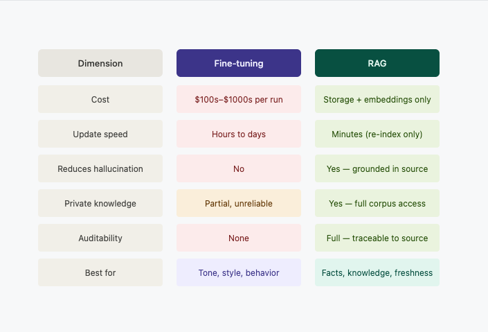

# Problems with LLMs Without RAG

## 1. Hallucination

LLMs generate text by predicting the next likely word — not by looking up facts. When they don't know something, they
don't say "I don't know". They **confidently produce wrong answers** that sound completely reasonable.

> *Ask an LLM about your internal API docs it has never seen — it will invent plausible-looking but incorrect details.*

---

## 2. Knowledge cutoff (staleness)

LLMs are trained once and frozen. Anything after the training date simply does not exist to them.

- A model trained in early 2024 knows nothing about late 2024 onwards. Training/Fine-tuning models is very expensive and
  time taken as you have to keep on doing this again and again and again as new data keeps on coming. Plus expertise is
  needed to train models(ML Engineers) and still you can't get the latest data because it's not possible to run train
  the model daily as data keeps on changing on daily basis.
- No awareness of your latest product updates, policy changes, or incidents.
- **You cannot ask it about things that happened last week.**

---

## 3. No access to private knowledge

LLMs are trained on public internet data. They have never seen:

- Your internal documentation
- Customer data, contracts, tickets
- Proprietary codebases or runbooks

**Fine-tuning is not the fix** — it is expensive, slow to update, and encodes behavior, not facts.

---

## 4. Correctness is not guaranteed

Even for topics the model was trained on, it can:

- Mix up facts across similar topics
- Confidently cite sources that don't exist (fabricated references)
- Give answers that were true at training time but are now outdated

There is **no built-in mechanism to verify** whether an answer is grounded in truth.

---

## 5. Cost of fixing it the wrong way

| Approach              | Problem                                                                                                                                                                                |
|-----------------------|----------------------------------------------------------------------------------------------------------------------------------------------------------------------------------------|
| Fine-tuning           | Expensive (~$000s), slow to re-run, hard to update or retract specific facts                                                                                                           |
| Larger context window | Costs more tokens per call; "lost in the middle" problem — LLMs attend poorly to content buried in long contexts                                                                       |
| Prompt stuffing       | Manually pasting docs into every prompt — not scalable, hits token limits fast(We do these when we attach some relevant documents to Cursor IDE, ChatGPT while asking them questions.) |

---

## 6. No auditability

When an LLM gives an answer, you cannot tell:

- *Where* that answer came from
- *Whether* it is based on real information
- *Which* document or source to check

In regulated industries (finance, healthcare, legal), this is a **compliance risk**, not just a quality issue.

---

## Summary

| Problem                  | Impact                                        |
|--------------------------|-----------------------------------------------|
| Hallucination            | Wrong answers delivered with false confidence |
| Staleness                | Blind to anything post training cutoff        |
| Private knowledge gap    | Cannot answer about your internal world       |
| No correctness guarantee | Even known facts can be wrong or mixed up     |
| Expensive workarounds    | Fine-tuning and context stuffing don't scale  |
| No auditability          | Cannot trace answers back to a source         |

> **Root cause:** The LLM only knows what it memorized during training.
> It has no way to look anything up at the time you ask.
> RAG solves exactly this — by giving it the right information *at the moment of the question*.

